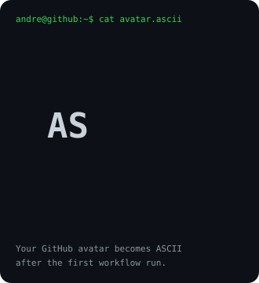

# `andre@github ~ $ ./contributions.sh`

<p align="center">
  
</p>

# `andre@github ~ $ whoami`

<table>
  <tr>
    <td width="42%" valign="top">
      
    </td>
    <td width="58%" valign="top">
      
    </td>
  </tr>
</table>

# `andre@github ~ $ ./stack.sh`

```txt
role      Backend Developer
company   Autumn Softwares
focus     APIs · SaaS · ERP · Fiscal systems
backend   Java · Spring Boot · TypeScript · NestJS
data      PostgreSQL · MySQL · Prisma · JPA/Hibernate · Redis
infra     Docker · GitHub Actions
frontend  Next.js · React
```

# `andre@github ~ $ ./links.sh`

<p align="left">
  <a href="https://github.com/AndreSchons">GitHub</a>
  &nbsp;•&nbsp;
  <a href="https://www.linkedin.com/in/andreschons/">LinkedIn</a>
</p>

<p>
  <sub>
    Terminal profile inspired by
    <a href="https://github.com/AVIVASHISHTA29/AVIVASHISHTA29">Avi Vashishta</a>.
    Profile art and contribution data are generated automatically by GitHub Actions.
  </sub>
</p>
